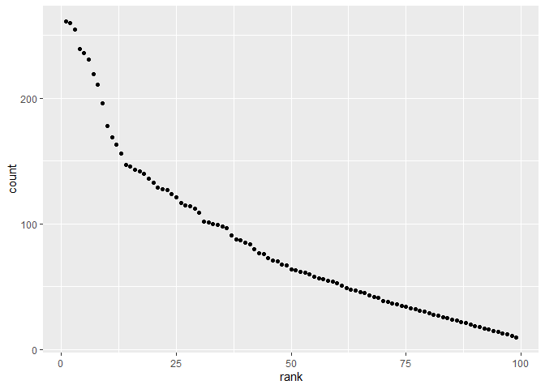

p8105\_hw2\_fw2334
================
Frances Williams
9/30/2019

# **PROBLEM 1**

## Creating datasets

#### *Tidying Mr. Trash Wheel dataset*

``` r
trash_data = read_excel(
  path = "data/TrashWheel2019.xlsx",
  sheet = "Mr. Trash Wheel",
  range = "A2:N406") %>% 
  janitor::clean_names() %>% 
  drop_na(dumpster) %>% 
  mutate(
    sports_balls = round(sports_balls, digits = 0),
    sports_balls = as.integer(sports_balls)
  )
```

#### *Preparing precipitation datasets*

``` r
precip_2017 = read_excel(
  path = "data/TrashWheel2019.xlsx",
  sheet = "2017 Precipitation",
  range = "A2:B14") %>%
  janitor::clean_names() %>% 
  drop_na(total) %>% 
  mutate(year = 2017)

    
precip_2018 = read_excel(
  path = "data/TrashWheel2019.xlsx",
  sheet = "2018 Precipitation",
  range = "A2:B14") %>%
  janitor::clean_names() %>% 
  drop_na(total) %>% 
  mutate(year = 2018)
```

#### *Joining precipitation datasets*

``` r
precip_data = 
  full_join(precip_2017, precip_2018, by = c("year", "month", "total")) %>% 
  mutate(
    month = month.name[month]
  )
```

## Description of the datasets

The `trash_data` dataset has 344 observations and includes data on the
types of trash collected by Mr. Trash Wheel dumpsters, such as `plastic
bottles` and `cigarette_butts`. The combined `precip_data` dataset has
24 observations, and the key variables `year`, `month`, and `total`
precipitation were used to merge the 2017 and 2018 datasets. The total
amount of precipitation in 2018 was 70.33 inches, and the median number
of sports balls in a dumpster in 2017 was 8.

# **PROBLEM 2**

## Creating datasets

#### *pols dataset*

``` r
pols_df = read_csv(file = "./data/pols-month.csv") %>%
  separate(mon, into = c("year", "month", "day"), sep = "-") %>% 
  mutate(
    month = month.abb[as.numeric(month)],
    month = str_to_lower(month),
    president = ifelse(prez_dem == 1, "dem", "gop")) %>% 
  select(-prez_gop, -prez_dem, -day)
```

    ## Parsed with column specification:
    ## cols(
    ##   mon = col_date(format = ""),
    ##   prez_gop = col_double(),
    ##   gov_gop = col_double(),
    ##   sen_gop = col_double(),
    ##   rep_gop = col_double(),
    ##   prez_dem = col_double(),
    ##   gov_dem = col_double(),
    ##   sen_dem = col_double(),
    ##   rep_dem = col_double()
    ## )

#### *snp dataset*

``` r
snp_df = read_csv(file = "./data/snp.csv") %>% 
  separate(date, into = c("month", "day", "year"), sep = "/") %>% 
  select(-day) %>% 
  mutate(
    month = month.abb[as.numeric(month)],
    month = str_to_lower(month)) %>% 
  arrange(year, month)
```

    ## Parsed with column specification:
    ## cols(
    ##   date = col_character(),
    ##   close = col_double()
    ## )

#### *unemployment dataset*

``` r
unemployment_df = read_csv(file = "./data/unemployment.csv") %>% 
  janitor::clean_names() %>% 
  pivot_longer(
    jan:dec,
    names_to = "month",
    values_to = "unemployment") %>% 
  mutate(year = as.character(year)) %>% 
  arrange(year, month)
```

    ## Parsed with column specification:
    ## cols(
    ##   Year = col_double(),
    ##   Jan = col_double(),
    ##   Feb = col_double(),
    ##   Mar = col_double(),
    ##   Apr = col_double(),
    ##   May = col_double(),
    ##   Jun = col_double(),
    ##   Jul = col_double(),
    ##   Aug = col_double(),
    ##   Sep = col_double(),
    ##   Oct = col_double(),
    ##   Nov = col_double(),
    ##   Dec = col_double()
    ## )

## Joining datasets

``` r
pols_snp = 
  left_join(pols_df, snp_df, by = c("year", "month"))

pols_snp_unemp = 
  left_join(pols_snp, unemployment_df, by = c("year", "month"))
```

## Description of datasets

The `pols_df` dataset includes data on the number of politicians by
political party (dem/gop) and position (sen/rep/gov/prez) by month and
year. The `snp_df` dataset contains the closing values of the S\&P stock
index by month and year. The `unemployment_df` dataset contains percent
unemployment by month and year. The merged dataset has 822 observations
and 11 variables; each row of data is for a single month, and the years
of data range from 1947 to 2015. Key variables linking the datasets are
`year` and `month`.

# **PROBLEM 3**

``` r
babynames_df = read_csv(file = "./data/Popular_Baby_Names.csv") %>% 
  janitor::clean_names() %>% 
  mutate(
    childs_first_name = str_to_title(childs_first_name),
    gender = str_to_lower(gender),
    ethnicity = str_to_lower(ethnicity),
    ethnicity = replace(ethnicity, ethnicity == "asian and paci", "asian and pacific islander"),
    ethnicity = replace(ethnicity, ethnicity == "black non hisp", "black non hispanic"),
    ethnicity = replace(ethnicity, ethnicity == "white non hisp", "white non hispanic")) %>% 
  distinct()
```

    ## Parsed with column specification:
    ## cols(
    ##   `Year of Birth` = col_double(),
    ##   Gender = col_character(),
    ##   Ethnicity = col_character(),
    ##   `Child's First Name` = col_character(),
    ##   Count = col_double(),
    ##   Rank = col_double()
    ## )

## Table 1: Olivia name rank by year and ethnicity

``` r
olivia_table = 
  babynames_df %>% 
  filter(childs_first_name == "Olivia") %>% 
  select(year_of_birth, ethnicity, rank) %>%
  pivot_wider(
    names_from = year_of_birth,
    values_from = rank) %>% 
  select(ethnicity, `2011`, `2012`, `2013`,`2014`, `2015`, `2016`)

knitr::kable(olivia_table)
```

| ethnicity                  | 2011 | 2012 | 2013 | 2014 | 2015 | 2016 |
| :------------------------- | ---: | ---: | ---: | ---: | ---: | ---: |
| asian and pacific islander |    4 |    3 |    3 |    1 |    1 |    1 |
| black non hispanic         |   10 |    8 |    6 |    8 |    4 |    8 |
| hispanic                   |   18 |   22 |   22 |   16 |   16 |   13 |
| white non hispanic         |    2 |    4 |    1 |    1 |    1 |    1 |

## Table 2: Male name popularity by year

``` r
malename_table = 
  babynames_df %>% 
  filter(
    gender == "male",
    rank == 1) %>% 
  select(year_of_birth, ethnicity, childs_first_name) %>% 
  pivot_wider(
    names_from = year_of_birth,
    values_from = childs_first_name) %>% 
  select(ethnicity, `2011`, `2012`, `2013`,`2014`, `2015`, `2016`)

knitr::kable(malename_table)
```

| ethnicity                  | 2011    | 2012   | 2013   | 2014   | 2015   | 2016   |
| :------------------------- | :------ | :----- | :----- | :----- | :----- | :----- |
| asian and pacific islander | Ethan   | Ryan   | Jayden | Jayden | Jayden | Ethan  |
| black non hispanic         | Jayden  | Jayden | Ethan  | Ethan  | Noah   | Noah   |
| hispanic                   | Jayden  | Jayden | Jayden | Liam   | Liam   | Liam   |
| white non hispanic         | Michael | Joseph | David  | Joseph | David  | Joseph |

## Scatterplot: Male white non-hispanic baby names by rank and count

``` r
babynames_scatter =
  babynames_df %>%
  filter(
    ethnicity == "white non hispanic", 
    year_of_birth == 2016,
    gender == "male")

ggplot(babynames_scatter, aes(x = rank, y = count)) +
  geom_point()
```

<!-- -->
